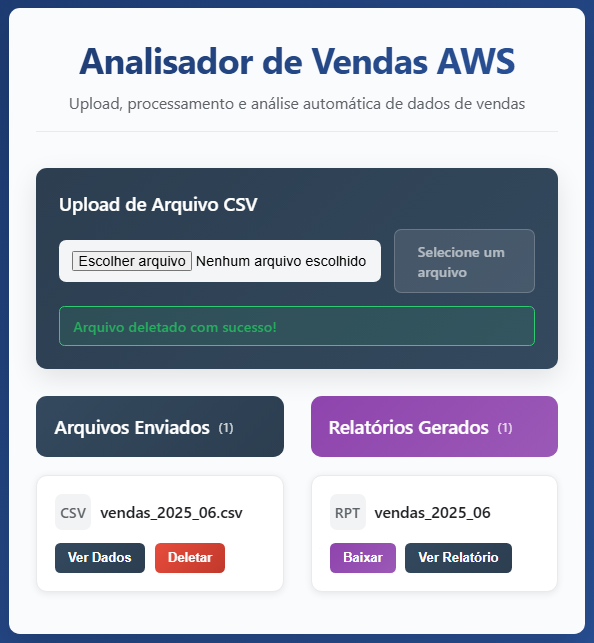
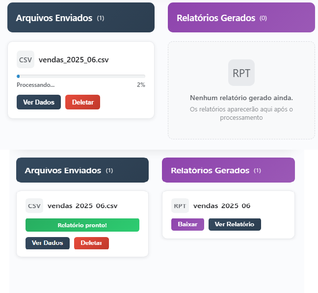
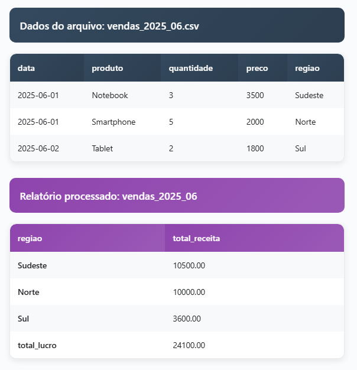
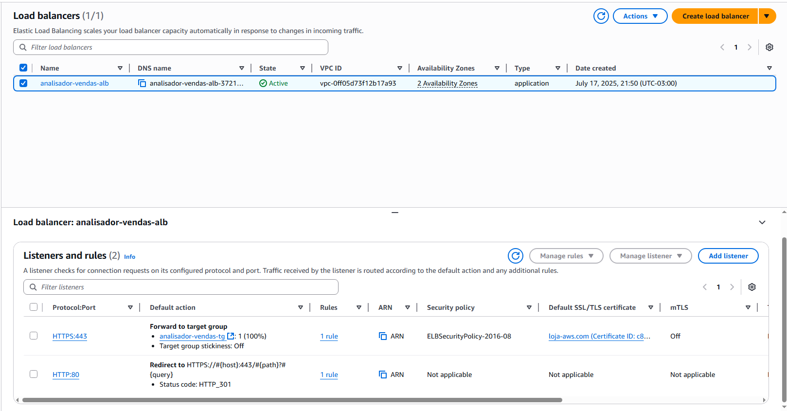

# Analisador de Vendas AWS

## O que esta aplicação faz?

O **Analisador de Vendas AWS** é uma solução completa para análise e visualização de dados de vendas, projetada para ambientes modernos de nuvem. A aplicação permite que usuários façam upload de arquivos CSV contendo dados de vendas, que são processados automaticamente por serviços AWS (como Lambda). Após o processamento, relatórios detalhados são gerados e disponibilizados para consulta e download através de uma interface web profissional e responsiva.

Principais funcionalidades:
- Upload seguro de arquivos CSV de vendas
- Processamento automatizado dos dados na AWS
- Geração de relatórios analíticos por região, período, produto, etc.
- Visualização dos relatórios em dashboards modernos
- Download dos relatórios em diversos formatos
- Infraestrutura provisionada automaticamente via Terraform (EC2, ALB, S3, Lambda, ECR, Route 53, IAM, VPC)
- Backend robusto em FastAPI (Python)
- Frontend moderno em React
- Deploy automatizado e seguro com Docker Compose




## 🚀 Sobre o Projeto

Este projeto é um portfólio completo de arquitetura moderna na AWS, com deploy automatizado, backend FastAPI, frontend React, processamento serverless, infraestrutura como código (Terraform) e CI/CD via ECR.

- **Infraestrutura:** AWS EC2, ALB, S3, Lambda, ECR, Route 53, IAM, Security Groups, VPC/Subnet, tudo provisionado via Terraform.
- **Backend:** FastAPI (Python), Docker, integração com S3 e Lambda.
- **Frontend:** React moderno, responsivo, Docker, Nginx.
- **Deploy:** Docker Compose, imagens versionadas no ECR, auto-clone do GitHub na inicialização da EC2.
- **Automação:** Health check, HTTPS, domínio customizado, deploy 100% automatizado.

## 🖼️ Prints para Portfólio

### 1. Tela principal (desktop)


### 2. Responsivo no celular


### 3. Upload de CSV e barra de progresso


### 4. Relatórios processados


### 5. AWS Console: ALB, EC2, ECR, S3, Route 53


## 🛠️ Como rodar

### Pré-requisitos
- AWS CLI configurado
- Terraform
- Docker e Docker Compose

### 1. Provisionar infraestrutura
```bash
cd terraform
terraform init
terraform apply
```

### 2. Build e push das imagens para o ECR
```bash
# Backend
docker build -t analisador-backend:latest ./backend
docker tag analisador-backend:latest 406951616480.dkr.ecr.us-east-1.amazonaws.com/analisador-backend:latest
docker push 406951616480.dkr.ecr.us-east-1.amazonaws.com/analisador-backend:latest

# Frontend
docker build -t analisador-frontend:latest ./frontend
docker tag analisador-frontend:latest 406951616480.dkr.ecr.us-east-1.amazonaws.com/analisador-frontend:latest
docker push 406951616480.dkr.ecr.us-east-1.amazonaws.com/analisador-frontend:latest
```

### 3. Acesse a EC2 e suba os containers
```bash
cd /opt/analisador-vendas
docker-compose -f docker-compose.prod.yml up -d
```

## 🌐 Acesse em produção

- https://loja-aws.com

---

## 💡 Diferenciais para Portfólio

- Infraestrutura como código (IaC) real, pronta para produção.
- Deploy automatizado e seguro.
- Design moderno, responsivo e com experiência de usuário aprimorada.
- Integração completa AWS (EC2, ALB, S3, Lambda, ECR, Route 53).
- Pronto para CI/CD e escalabilidade.

---

## 👨‍💻 Autor

Gabriel Alcantara  
[LinkedIn](https://www.linkedin.com/in/seu-linkedin)  
[GitHub](https://github.com/GabrielAlcantara1304)

---

## 📸 Prints sugeridos para LinkedIn e README

- Tela principal do sistema (desktop)
- Tela mobile/responsiva
- Tela de upload de CSV com barra de progresso
- Tela de relatórios processados
- Console AWS mostrando ALB, EC2, ECR, S3, Route 53
- Código do Terraform aberto no VSCode
- Pipeline de build/push para o ECR (opcional)

---

## ⭐ Dê uma estrela se gostou do projeto!
